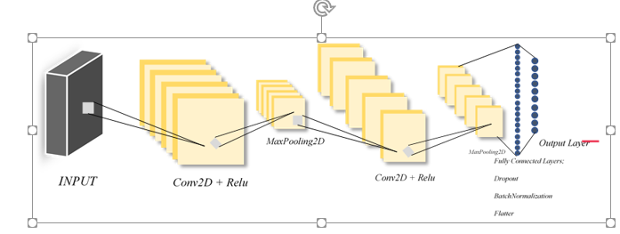

# Machine-Learning
Three different Architecture of Neural Networks as follows 
Architecture 1:
1.	The following Architecture is Built using Kera’s Sequential API:	
 
 
•	Here I am using two Conv2d Layers with 32 and 64 filters using relu activation function, Kernel size 3. 
•	Every Conv2D layer is followed immediately by a MaxPooling2D layer with a pool size= (2,2)
•	Dropout has been used to overcome overfitting used with different filters in between flatter 
•	BatchNormalization()-Batch normalization enables the use of higher learning rates, greatly accelerating the learning process.
•	Then we follow with Dense layer with 128 nodes and sigmoid activation
•	Finally, output layer is a Dense layer with 10 nodes and activation function = SoftMax for multi-class classification.

Test loss: 0.024450226167993243
Test accuracy: 0.992900013923645
dict_keys(['val_loss', 'val_accuracy', 'loss', 'accuracy'])
  
For the above architecture we have 99.29% accuracy, we see that test and train accuracy above 99% near after 10 epochs’, this model for 12 epochs. Train and Test loss is reaching nearly 0.025 after 10 epochs. 
Note: on the above model, for Optimization we are using “keras.optimizers.Adadelta()”

Architecture 2:

1.	The following Architecture is Built using Kera’s Sequential API:
•	Here I am using three Conv2d Layers with 32 and two 64 filters using relu activation function, Kernel size 3. 
•	Every Conv2D layer is followed immediately by a MaxPooling2D layer with a pool size= (2,2)
•	Dropout has been used to overcome overfitting used with different filters in between flatter 
•	Then we follow with Dense layer with 128 nodes and relu activation
•	Finally, output layer is a Dense layer with 10 nodes and activation function = SoftMax for multi-class classification.

Test loss: 0.029157119183929173
Test accuracy:0.9909999966621399

dict_keys(['val_loss', 'val_accuracy', 'loss', 'accuracy'])

For the above architecture we have 99.1% accuracy, we see that test and train accuracy almost to 99% accuracy after 4 epochs’, this model for 4 epochs. Train and Test loss is reaching nearly 0.005 after 4 epochs. 
Note: on the above model, for Optimization we are using “keras.optimizers.Adadelta()”
AR_3Results.png
Architecture 3:

The following Architecture is Built using Kera’s Sequential API:
•	Here I am using three Conv2d Layers with 32 with relu activation, Conv2d Layers with 64 using tanh activation function and Conv2d Layers 64 filter with relu activation, Kernel size 3. 
•	Every Conv2D layer is followed immediately by a MaxPooling2D layer with a pool size= (2,2)
•	The difference here is there no Dropout used and we can see in the below graph the accuracy is reduce and fluctuating.  
•	Then we follow with Dense layer with 128 nodes and relu activation
•	Finally, output layer is a Dense layer with 10 nodes and activation function = SoftMax for multi-class classification.
•	With the learning rate of 0.1

Test loss: 0.0504283158945851
Test accuracy: 0.983299970626831
  

For the above architecture we have 98% accuracy, we see that test and train accuracy is slightly a 98% accuracy after 6 epochs’, this model for 6 epochs. Train and Test loss is reaching nearly 0.05 after 5 epochs. In this model we are using customized learning rate i.e. 0.1

Comparing all the three Models, first model has better accuracy rate with 12 epochs, in second architecture accuracy is all most same has first one with 4 epochs. In the last model we can see the accuracy is low, because we have not used any dropout layers and its inefficient.

Predecting House Prcies 

LINEAR REGRESSION MODEL
• Linear Regression is a one of the Supervised Machin learning 
algorithms, it used to predict dependent value y based on the given 
independent variable x.

SUPPORT VECTOR MACHINE(SVMR)
Support Vector Regression (SVR) is quite different than other 
Regression models. It uses the Support Vector Machine (SVM, a 
classification algorithm) algorithm to predict a continuous variable. 
While other linear regression models try to minimize the error between 
the predicted and the actual value, Support Vector Regression tries to fit 
the best line within a predefined or threshold error value. 

K-NEAREST NEIGHBORS
• KNN is a non-parametric and lazy learning algorithm. Non-parametric 
means there is no assumption for underlying data distribution.
• In other words, the model structure determined from the dataset. This 
will be very helpful in practice where most of the real-world datasets do 
not follow mathematical theoretical assumptions. 
• Lazy algorithm means it does not need any training data points for 
model generation. All training data used in the testing phase. This 
makes training faster and testing phase slower and costlier.
4
• Costly testing phase means time and memory. In the worst case, KNN 
needs more time to scan all data points and scanning all data points will 
require more memory for storing training data.
KNN has the following basic steps:
• Calculate distance
• Find closest neighbours
• Vote for labels

References: https://keras.io/api/ , https://mlexplained.com/2018/01/10/an-intuitive-explanation-of-why-batch-normalization-really-works-normalization-in-deep-learning-part-1/
